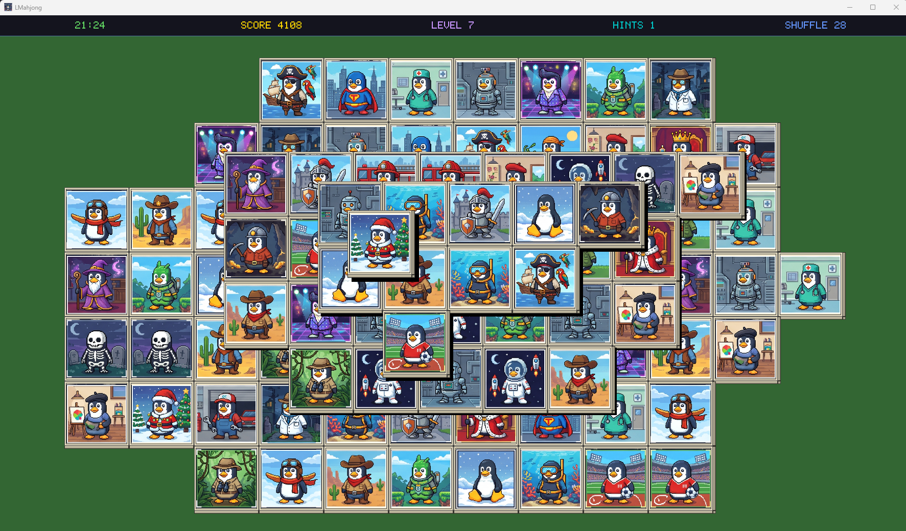

# LMahjong

A Tux-themed Mahjong solitaire game for Linux, built with Rust and SDL2.

## About

LMahjong is a classic tile-matching solitaire game featuring Tux penguin-themed graphics. Clear all 144 tiles from the board by matching pairs of free tiles. The game uses the traditional Turtle layout with 5 stacked layers, and every generated board is guaranteed to be solvable.



### Features

- Classic Turtle layout with 144 tiles across 5 layers
- Guaranteed solvable boards via reverse-deal generation
- Hint system, undo (up to 10 moves), and shuffle (up to 3 per game)
- Timer and scoring system with local leaderboard (top 10)
- Keyboard shortcuts for all actions
- Audio feedback with mute support
- Resizable window (min 1920×1080, adapts to screen resolution)
- Native Linux packages (.deb, .rpm, AppImage)

## Prerequisites

### System Dependencies

You need SDL2 development libraries installed:

**Ubuntu / Debian:**

```bash
sudo apt install libsdl2-dev libsdl2-image-dev libsdl2-mixer-dev libsdl2-ttf-dev pkg-config
```

**Fedora:**

```bash
sudo dnf install SDL2-devel SDL2_image-devel SDL2_mixer-devel SDL2_ttf-devel pkg-config
```

**Arch Linux:**

```bash
sudo pacman -S sdl2 sdl2_image sdl2_mixer sdl2_ttf pkg-config
```

### Rust Toolchain

Install Rust via [rustup](https://rustup.rs/):

```bash
curl --proto '=https' --tlsv1.2 -sSf https://sh.rustup.rs | sh
```

## Building

```bash
# Debug build
cargo build

# Release build (optimized)
cargo build --release
```

**macOS (requires Homebrew SDL2 libraries):**
```bash
brew install sdl2 sdl2_image sdl2_mixer sdl2_ttf pkg-config
LIBRARY_PATH="/opt/homebrew/lib" cargo build --release
```

The binary is output to `target/debug/lmahjong` or `target/release/lmahjong`.

## Running

```bash
# Run directly
cargo run

# Or run the release binary
cargo run --release
```

## Running Tests

```bash
# Run all tests (unit + property-based)
cargo test

# Run only unit tests
cargo test --lib

# Run a specific property test file
cargo test --test board_properties

# Run tests with output shown
cargo test -- --nocapture
```

The project includes 19 property-based tests using `proptest` that validate correctness properties like board generation invariants, solvability, matching logic, undo/redo behavior, shuffle guarantees, and layout scaling.

## Controls

| Shortcut | Action |
|----------|--------|
| Left click | Select tile |
| Ctrl+S | Save game |
| Ctrl+Q | Save + Quit |
| Ctrl+N | New Game |
| Ctrl+R | Resume |
| Ctrl+P | Pause |
| Ctrl+M | Toggle Mute |
| Shift+S | Shuffle |
| Shift+U | Undo |
| Shift+H | Hint |
| Escape | Pause / Resume (toggle) |

## Scoring

Score starts at 0 and increases with each pair matched:

- **Base:** +10 points per pair removed
- **Streak bonus:** +2 per pair (rewards continuous play)
- **Penalties:** −5 per hint used, −10 per shuffle used
- **Time bonus** (at game end): max(0, 500 − elapsed_seconds)

Top 10 scores are saved to a local leaderboard.

## Packaging (.deb, .rpm, AppImage)

A packaging script is included to create distribution packages:

```bash
# Build all three formats
./package.sh all

# Or build individually
./package.sh deb
./package.sh rpm
./package.sh appimage
```

Output goes to `target/package/`.

### Prerequisites for packaging

| Format | Tool needed | Install with |
|--------|-------------|--------------|
| .deb | dpkg-deb | Pre-installed on Debian/Ubuntu |
| .rpm | rpmbuild | `sudo dnf install rpm-build` |
| AppImage | wget | Pre-installed on most distros (downloads appimagetool automatically) |

### Installing the packages

**.deb (Ubuntu/Debian):**
```bash
sudo apt install ./target/package/lmahjong_0.1.0_amd64.deb
```
This automatically installs SDL2 runtime dependencies via apt.

**.rpm (Fedora/RHEL):**
```bash
sudo dnf install ./target/package/lmahjong-0.1.0-1.x86_64.rpm
```
This automatically installs SDL2 runtime dependencies via dnf.

**AppImage (any distro):**
```bash
chmod +x target/package/lmahjong-0.1.0-x86_64.AppImage
./target/package/lmahjong-0.1.0-x86_64.AppImage
```
AppImages bundle SDL2 libraries inside, so no system dependencies are needed.

**macOS (.app bundle):**
```bash
cp -R LMahjong-0.1.0-aarch64.app /Applications/
open /Applications/LMahjong-0.1.0-aarch64.app
```
Copy the `.app` to your Applications folder and launch it. The app bundle includes all SDL2 libraries — no Homebrew or other dependencies required.

**macOS (.dmg disk image):**
```bash
open LMahjong-0.1.0-arm64.dmg
```
Double-click the `.dmg` to mount it, then drag `LMahjong.app` into the Applications folder. No additional dependencies are needed.

## Assets


## Data Storage

All game data is stored as JSON files in a platform-specific directory:

| Platform | Path |
|----------|------|
| **Linux** | `~/.local/share/lmahjong/` |
| **macOS** | `~/Library/Application Support/lmahjong/` |
| **Windows** | `%APPDATA%\lmahjong\` (e.g. `C:\Users\<user>\AppData\Roaming\lmahjong\`) |

### Files

| File | Description |
|------|-------------|
| `leaderboard.json` | Top 10 scores with player name, score, time, hints used, shuffles used, undos used, and date |
| `settings.json` | Persistent settings (muted state) |
| `savegame.json` | In-progress game state for resuming later (deleted after loading) |

### Menu

- Pause menu (render_menu) — ✅ Has keyboard nav
- Victory (render_victory) — ✅ Has keyboard nav
- Leaderboard (render_leaderboard) — ✅ Has Enter/Escape support
- Shortcuts (render_shortcuts) — ✅ Has Enter/Escape support
- No Moves (render_no_moves) — ✅ Has Shuffle + New Game buttons
- Game Over (render_game_over) — ✅ Has Save Score + New Game buttons
- Quit Confirmation (render_quit_confirmation) — ✅ Has Yes/No buttons
- Name Entry (render_name_entry) — ✅ Text input

## License

This project is licensed under the [GNU General Public License v3.0](LICENSE).
